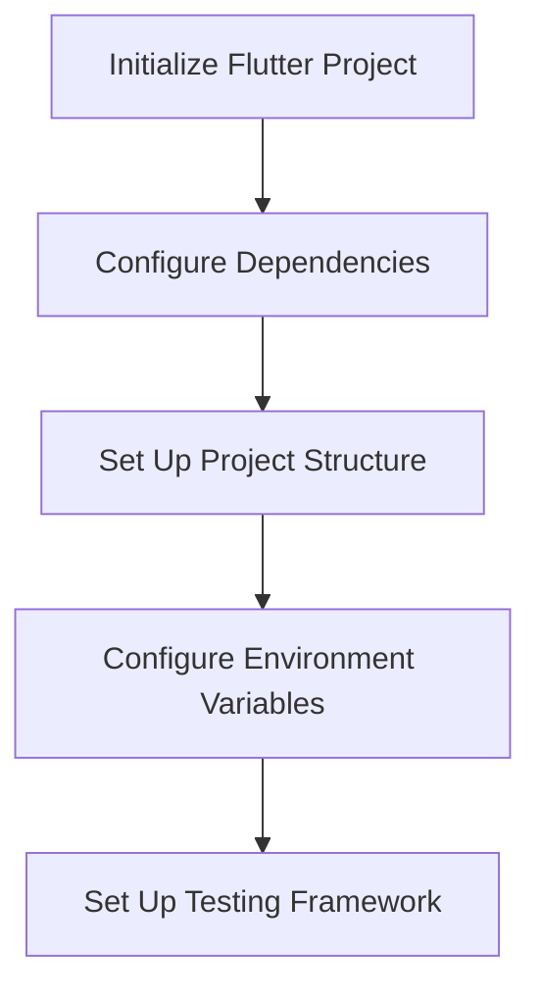
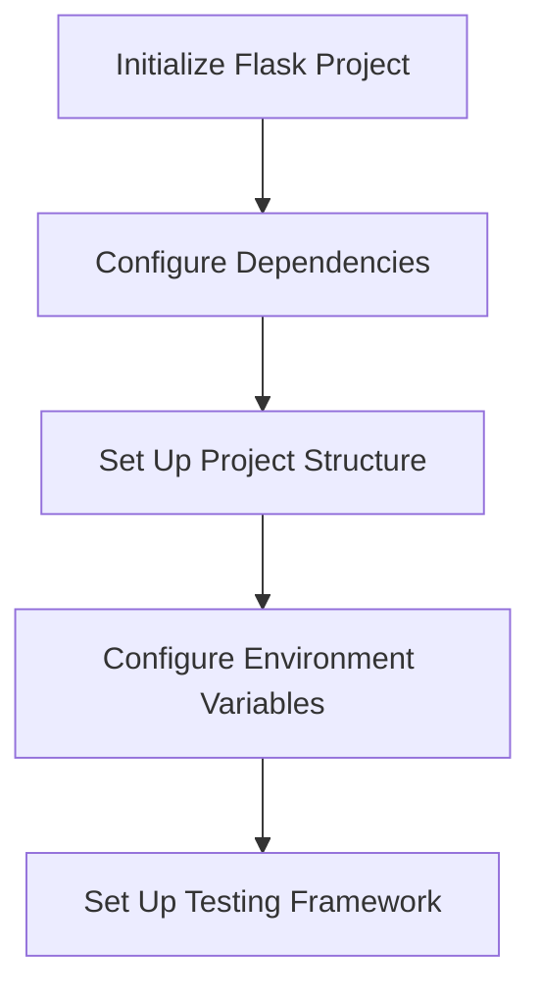
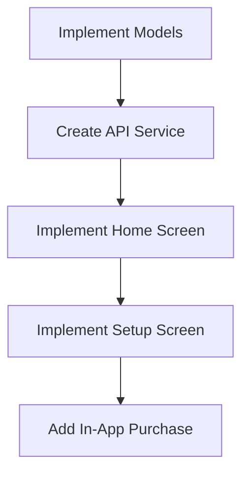
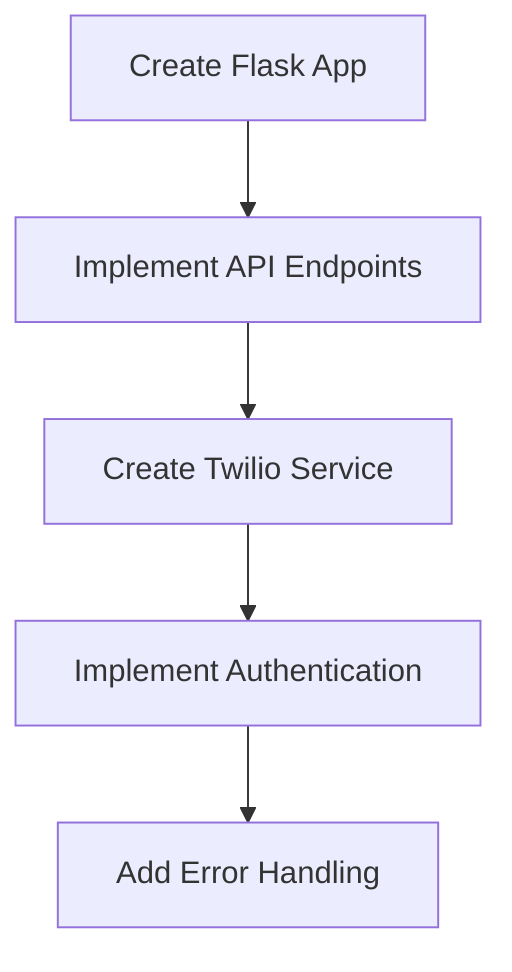
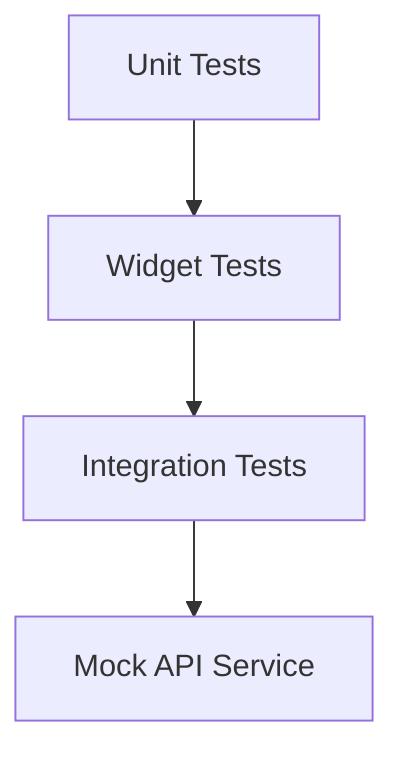
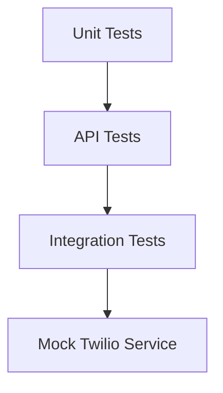
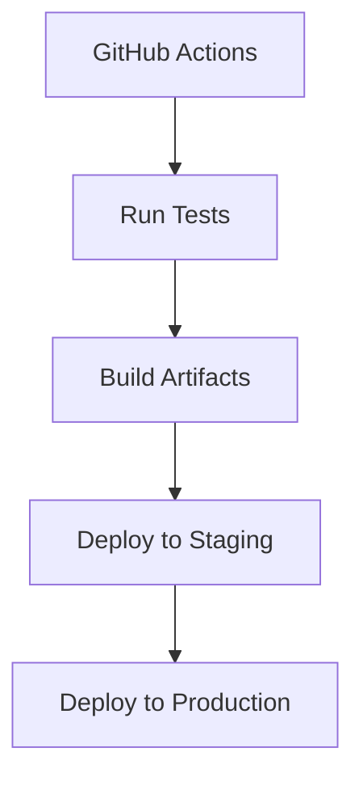
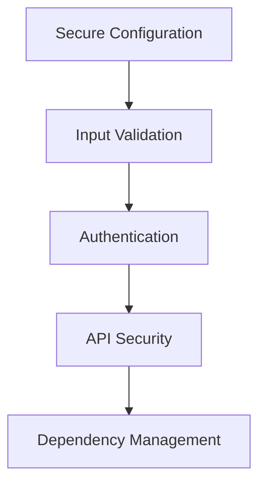
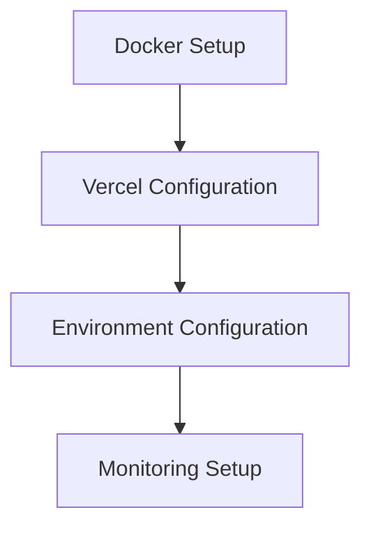

# Exit Strategy App - Implementation Plan

## 1. Project Setup and Configuration

### Flutter Frontend Setup

1. **Update pubspec.yaml with required dependencies:**
   - `http`: For API communication
   - `provider`: For state management
   - `shared_preferences`: For local storage
   - `in_app_purchase`: For subscription handling
   - `flutter_test`: For testing

2. **Create proper project structure:**
   - `lib/models/`: Data models
   - `lib/screens/`: UI screens
   - `lib/services/`: API and business logic
   - `lib/widgets/`: Reusable UI components
   - `lib/utils/`: Utility functions
   - `test/`: Unit and widget tests

3. **Set up environment configuration:**
   - Create environment-specific configuration files
   - Implement secure storage for API endpoints

### Python Backend Setup

1. **Organize backend structure:**
   - `app.py`: Main application entry point
   - `api/`: API routes and controllers
   - `services/`: Business logic and external services
   - `models/`: Data models
   - `tests/`: Unit and integration tests
   - `config.py`: Configuration management

2. **Set up environment variables:**
   - Create `.env.example` file with placeholder values
   - Document environment variable requirements
   - Implement secure loading of environment variables

3. **Configure testing environment:**
   - Set up pytest for unit testing
   - Create mock services for Twilio integration

## 2. Core Feature Implementation

### Frontend Implementation

1. **Create data models:**
   - `RescueTemplate`: Model for rescue message templates
   - `UserSettings`: Model for user configuration

2. **Implement API service:**
   - Create service for communicating with backend
   - Implement error handling and retry logic

3. **Build UI screens:**
   - Home screen with "Rescue Me" button
   - Setup screen for template selection and configuration
   - Settings screen for Twilio number and preferences

4. **Implement in-app purchase:**
   - Set up subscription handling
   - Implement feature gating based on subscription status

### Backend Implementation

1. **Set up Flask application:**
   - Configure CORS and security headers
   - Set up request validation

2. **Implement API endpoints:**
   - `POST /send-rescue`: Send rescue message via Twilio
   - `GET /templates`: Get available message templates
   - `POST /verify-subscription`: Verify user subscription

3. **Create Twilio service:**
   - Implement SMS sending functionality
   - Add support for delayed messages
   - Implement error handling for Twilio API

4. **Add security measures:**
   - Input validation and sanitization
   - Rate limiting to prevent abuse
   - Secure handling of Twilio credentials

## 3. Testing Strategy

### Frontend Testing

1. **Unit tests:**
   - Test data models and business logic
   - Test utility functions
   - Test state management

2. **Widget tests:**
   - Test UI components in isolation
   - Test screen navigation
   - Test user interactions

3. **Integration tests:**
   - Test complete user flows
   - Test API communication with mocks

### Backend Testing

1. **Unit tests:**
   - Test business logic
   - Test utility functions
   - Test configuration management

2. **API tests:**
   - Test endpoint behavior
   - Test input validation
   - Test error handling

3. **Integration tests:**
   - Test complete request flows
   - Test Twilio integration with mocks

## 4. CI/CD Pipeline

1. **Set up GitHub Actions workflow:**
   - Configure CI pipeline for both frontend and backend
   - Run tests on pull requests and merges to main branch
   - Build artifacts for deployment

2. **Implement deployment automation:**
   - Configure Docker build and push
   - Set up Vercel deployment
   - Implement environment-specific configurations

3. **Add quality checks:**
   - Code linting and formatting
   - Security scanning
   - Dependency vulnerability checks

## 5. Security Measures

1. **Secure configuration management:**
   - Use environment variables for sensitive information
   - Implement secure storage for API keys
   - Create separate configurations for different environments

2. **Input validation and sanitization:**
   - Validate all user inputs
   - Sanitize data before processing
   - Implement proper error handling

3. **API security:**
   - Implement rate limiting
   - Add security headers
   - Use HTTPS for all communications

4. **Dependency management:**
   - Regularly update dependencies
   - Scan for vulnerabilities
   - Use lockfiles to ensure consistent builds

## 6. Deployment Strategy

1. **Docker deployment:**
   - Create optimized Dockerfile
   - Configure Docker Compose for local development
   - Document deployment process

2. **Vercel deployment:**
   - Configure serverless functions
   - Set up environment variables
   - Document deployment process

3. **Monitoring and logging:**
   - Implement error tracking
   - Set up performance monitoring
   - Configure logging for debugging

## Timeline and Milestones

1. **Week 1: Project Setup and Basic Structure**
   - Set up development environments
   - Configure project structure
   - Implement basic models and services

2. **Week 2: Core Feature Implementation**
   - Implement frontend UI
   - Create backend API endpoints
   - Set up Twilio integration

3. **Week 3: Testing and Security**
   - Implement unit and integration tests
   - Add security measures
   - Set up CI/CD pipeline

4. **Week 4: Polishing and Deployment**
   - Refine UI and UX
   - Optimize performance
   - Deploy MVP to production